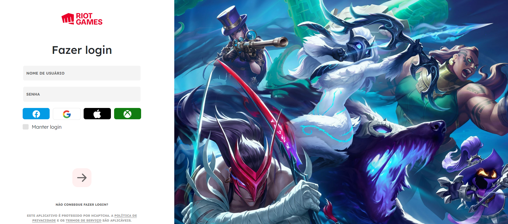

# Clone do login do jogo League of Legends
Cópia da tela de login do jogo League of Legends. Este projeto foi feito para colocar em prática efeitos de input.

## :computer:Tecnologias utilizadas:
+ JavaScript 
+ Html e CSS 
+ Bootstrap

## :pushpin:Referência:
[Site oficial para baixar o jogo](https://www.leagueoflegends.com/pt-br/)

## :diamonds:Link para o clone:
[Login League of Legends](https://francine02.github.io/Tela-de-Login---League-of-Legends/)

